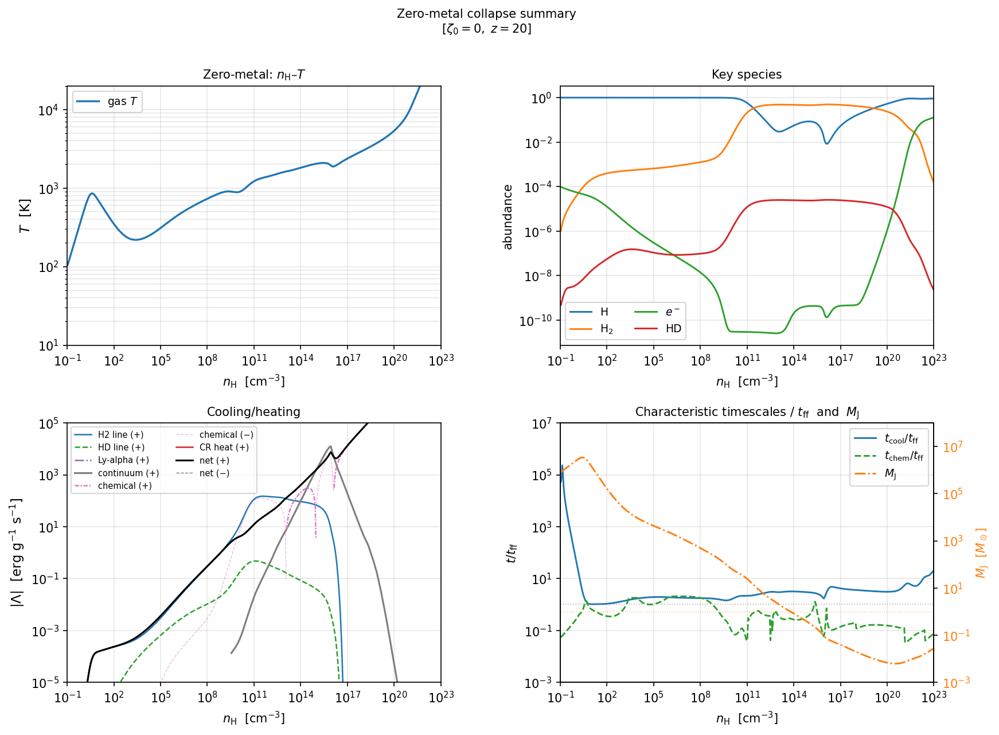
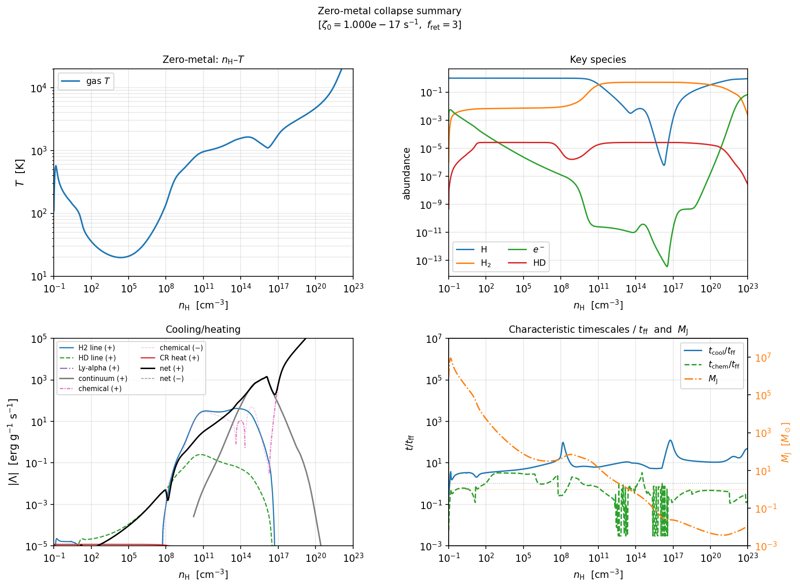
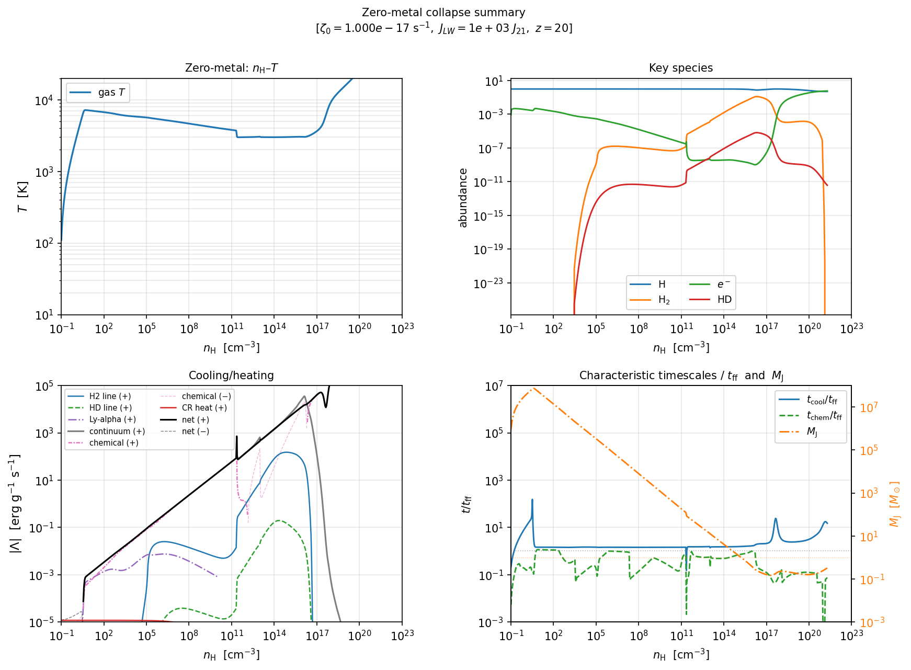
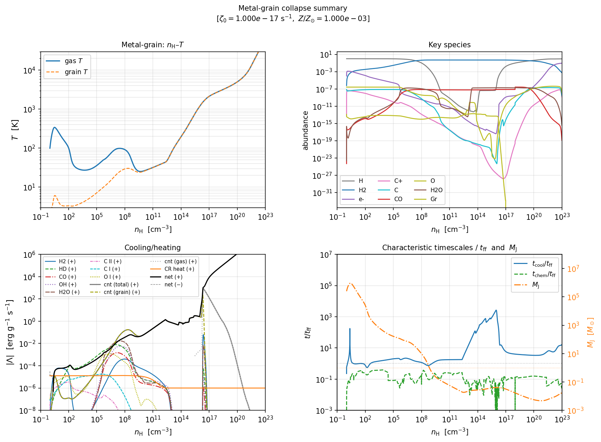
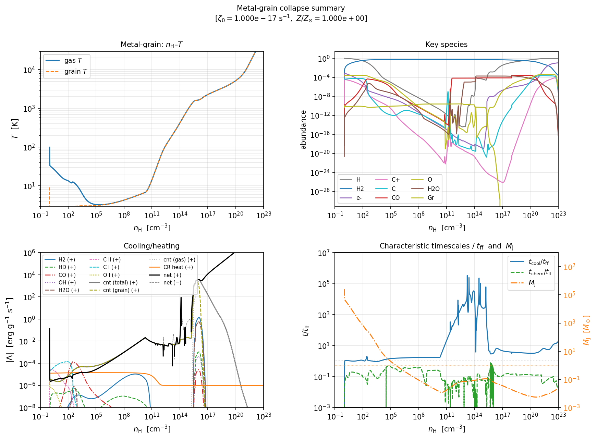

# ARCHE

ARCHE - Astrophysical Routines for CHemical Evolution

## Overview

One-zone gravitational collapse and standalone chemistry integration for
**primordial (zero-metal)** and **metal-grain** gas, implemented in C++17.

This repository provides collapse applications (`prim_collapse`, `metal_collapse`),
standalone chemistry demos (`prim_chem`, `metal_chem`), and a unified wrapper
(`run_collapse.sh`) for build → simulate → plot → resample workflows.

Release version: see [`VERSION`](VERSION).

For setup and full usage details, see:
- `docs/getting_started.md`
- `docs/parameters.md`
- `docs/api_reference.md`
- `docs/output_schema.md`

Auxiliary tool (WIP):
- `tools/eos_mhd_table_generator/README.md` (EOS-MHD table generator for MHD workflows)

---

## Quick Start

All commands are run from the project root. Generated summary figures are stored in `docs/img/quickstart/`.

1. Primordial (H2-cooling) with `T_CMB` (at $z=20$)

```bash
bash run_collapse.sh \
  --no-metal \
  --prim-zeta0 0 \
  --prim-redshift 20 \
  --fig-combo \
  --no-resample \
  --save-dir results/quickstart/case_1 \
  --out-dir results/quickstart/case_1
```



2. Primordial (HD-cooling) with slow collapse

```bash
bash run_collapse.sh \
  --no-metal \
  --prim-zeta0 1e-17 \
  --prim-ff-ret 3.0 \
  --fig-combo \
  --no-resample \
  --save-dir results/quickstart/case_2 \
  --out-dir results/quickstart/case_2
```



3. Primordial (H-cooling) with `CR`, `J_LW`, and `T_CMB` (at $z=20$)

```bash
bash run_collapse.sh \
  --no-metal \
  --prim-zeta0 1e-17 \
  --prim-jlw21 1e3 \
  --prim-redshift 20 \
  --fig-combo \
  --no-resample \
  --save-dir results/quickstart/case_3 \
  --out-dir results/quickstart/case_3
```



4. Low-metallicity with `CR`

```bash
bash run_collapse.sh \
  --no-prim \
  --metal-zeta0 1e-17 \
  --metal-z-metal 1e-3 \
  --fig-combo \
  --no-resample \
  --save-dir results/quickstart/case_4 \
  --out-dir results/quickstart/case_4
```



5. Solar metallicity

```bash
bash run_collapse.sh \
  --no-prim \
  --metal-zeta0 1e-17 \
  --metal-z-metal 1.0 \
  --fig-combo \
  --no-resample \
  --save-dir results/quickstart/case_5 \
  --out-dir results/quickstart/case_5
```



---

## Citation

If you use ARCHE for a scientific publication, we ask that you cite the code in the following way in the main text of your paper:

> In this study, we use publicly-available {\tt ARCHE}\footnote{https://github.com/astro-sim-lab/arche} code for solving chemical reactions, which is based on the method described in Nakauchi et al. (2019; 2021).

> Nakauchi et al. (2019) MNRAS, 488, 1846 [[ADS](https://ui.adsabs.harvard.edu/abs/2019MNRAS.488.1846N/abstract)] ... primordial

> Nakauchi et al. (2021) MNRAS, 502, 3394 [[ADS](https://ui.adsabs.harvard.edu/abs/2021MNRAS.502.3394N/abstract)] ... metal_grain

---

## License

This project is licensed under the MIT License — see [LICENSE](LICENSE) for details.
