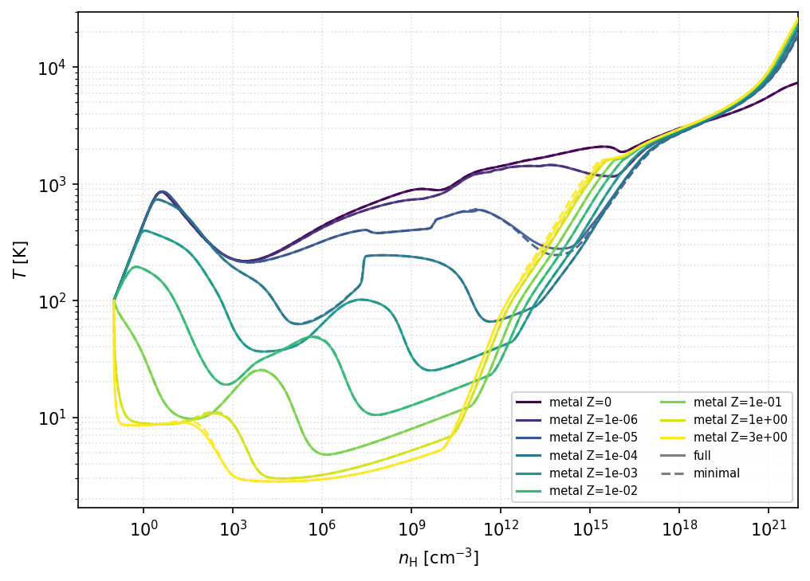
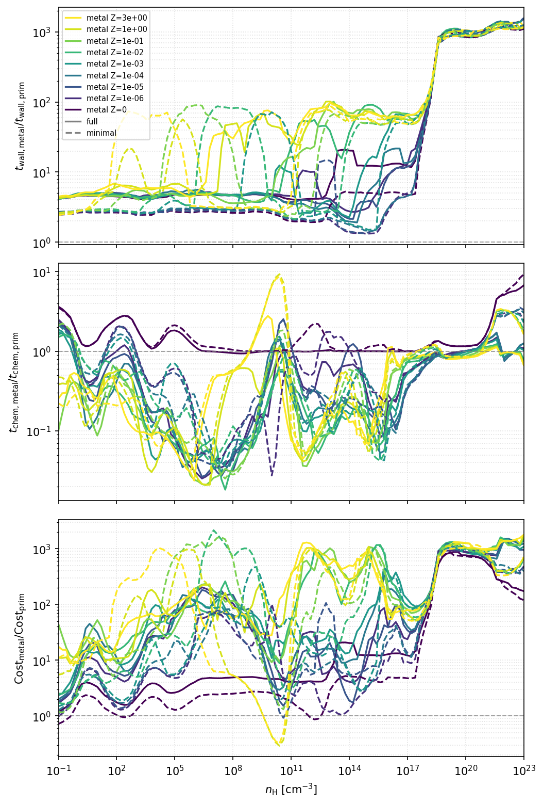
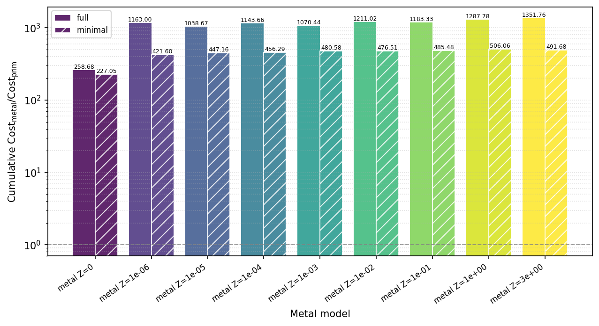
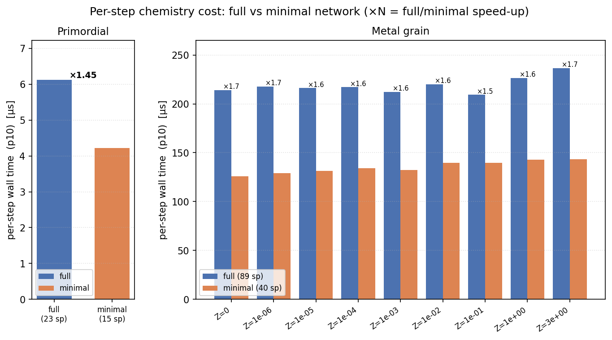

# Benchmark: Per-Step Computation Time

This document summarizes the per-step wall-clock timing of the chemistry
kernel (`chem_full_step`) across the primordial and metal-grain networks,
measured as a function of H number density and metallicity.  It also
includes a simple estimate based on the chemistry timescale `t_chem`.

---

## Purpose

Quantify the relative computational cost of each network variant so that
the overhead of the metal-grain solver (89 species) compared to the
zero-metal solver (23 species) can be estimated as a function of
metallicity Z/Z☉ and density nH.

---

## Benchmark conditions

| Parameter | Value |
|---|---|
| CR ionization rate ζ₀ | 0 (no cosmic rays) |
| Free-fall retardation | 1.0 (standard free-fall) |
| Lyman-Werner field J₂₁ | 0 (none) |
| Redshift | 0 (no CMB contribution) |
| All other parameters | default values |

### Models

| Label | Binary | Z/Z☉ |
|---|---|---|
| prim | `prim_collapse` | 0 (zero-metal, 23 species) |
| metal Z=0 | `metal_collapse` | 0 |
| metal Z=1e-6 | `metal_collapse` | 10⁻⁶ |
| metal Z=1e-5 | `metal_collapse` | 10⁻⁵ |
| metal Z=1e-4 | `metal_collapse` | 10⁻⁴ |
| metal Z=1e-3 | `metal_collapse` | 10⁻³ |
| metal Z=1e-2 | `metal_collapse` | 10⁻² |
| metal Z=1e-1 | `metal_collapse` | 10⁻¹ |
| metal Z=1 | `metal_collapse` | 1 (solar) |
| metal Z=3 | `metal_collapse` | 3 |

The `metal Z=0` case isolates the cost of the larger network (89 species)
independent of metallicity-dependent chemistry.

Each metal case is run with both networks: the **full** 89-species network
(`metal_collapse`) and the compact **minimal** 40-species network
(`arche_collapse_metal_minimal`).  In every figure below the two variants share
a colour per metallicity and are distinguished by line/bar style — full is
solid (and a solid bar), minimal is dashed (and a hatched bar).  This lets the
extra cost of the full network be read directly against the minimal model at
matched Z.

---

## Results

### Test-run trajectories

- As a visual reference for the benchmark set, this figure shows the
  `nH-T` trajectories of the metal-model test runs used below (solid = full,
  dashed = minimal).
- The benchmark timing and cost-estimate figures should be interpreted along
  these thermal tracks, not as density-independent averages.

### Simple estimate based on `t_chem`

- Top panel: `wall_time_metal / wall_time_prim` for one chemistry call.
- Middle panel: `t_chem,metal / t_chem,prim`, which controls the relative
  number of chemistry subcycles if the outer timestep `dt` is fixed.
- Bottom panel: a simple local estimate of the chemistry cost ratio,
  `Cost_metal / Cost_prim`, obtained from the product of the two effects above.

In all three panels the dashed curves are the minimal network and the solid
curves the full network, at matched metallicity.

All three panels are smoothed on a shared `log10(nH)` grid with 0.2 dex
spacing and a moving window of ±0.5 dex.

This ratio alone is **not** the total 3D cost ratio.  To estimate the
chemistry-related computational cost in a hydrodynamical simulation, one would
need the product

`(dt / dt_chem) × (wall time per step)`

and compare it between prim and metal.  In practice, however, the actual outer
timestep `dt` depends on the hydrodynamical timescale and other timestep
criteria, so this repository by itself cannot determine the final
`prim / metal` cost ratio for a coupled 3D code.

Therefore, we use the figure above only as a **simple order-of-magnitude
estimate** of the local chemistry cost ratio.

As a compact summary, we also show the cumulative cost ratio obtained by
integrating the local estimate over the shared `log10(nH)` range and taking
the final value for each metal model.  This bar chart is the closest proxy in
this repository to the total chemistry cost ratio `metal / prim`, although it
still excludes hydro, gravity, I/O, and any timestep criteria outside the
chemistry module.  Each metallicity shows a pair of bars — the solid bar is the
full network and the hatched bar the minimal network — so the cost saved by the
compact network is read off directly (roughly a factor of ~2 across the grid).

The cumulative value integrates the local estimate over the full benchmark
density range, up to the `n_H = 10²³ cm⁻³` ceiling.  The integrand is largest
in the high-density tail (`n_H ≳ 10¹⁸ cm⁻³`), where the gas is hot and the full
89-species network — grain-surface reactions and a stiff implicit solve — is
most expensive relative to prim.  That tail therefore **dominates** the
cumulative ratio: integrating only up to `n_H ≈ 10²⁰ cm⁻³` gives ~400, whereas
extending to `10²³ cm⁻³` raises it to ~1300.  The number is thus a property of
the chosen density range as much as of the network, and should be read together
with the `nH-T` trajectories above.

### Full vs minimal: per-step cost within each network

The figures above all reference the prim network.  This last one instead
compares, **within each network**, the full and minimal variants directly:
primordial (`prim_collapse`, 23 species, vs `arche_collapse_prim_minimal`,
15 species) on the left, and metal-grain (`metal_collapse`, 89 species, vs
`arche_collapse_metal_minimal`, 40 species) on the right.

- The bar height is the **10th-percentile per-step wall time** [µs].  A low
  percentile is used deliberately: it estimates the per-call compute cost with
  the least scheduler/load contention.  The run-wide mean or median is far
  noisier — a single contended segment can shift it by an order of magnitude,
  occasionally even making the smaller network appear slower.
- `×N` above each pair is the full/minimal speed-up.  The minimal network is
  ≈1.45× faster for primordial and ≈1.5–1.7× faster for metal-grain, roughly
  flat across metallicity.
- The speed-up is well below the naive species-count ratio (e.g. `(89/40)³`):
  the implicit solve is only one part of `chem_full_step`, and the per-call
  fixed costs (rate evaluation, cooling, table lookups) are shared.

---

## Notes

- Timing is measured around the `chem_full_step` call only; I/O and HDF5
  output are excluded.
- The `metal Z=0` model shows the overhead of the 89-species network
  itself, irrespective of metal chemistry.
- At high density (nH ≳ 10¹⁰ cm⁻³), per-step time can increase due to
  grain surface reactions and additional line-cooling terms activated in
  the metal network.
- The `t_chem`-based cost figures are simplified diagnostics, not a substitute
  for timestep control implemented in a specific hydro code.
