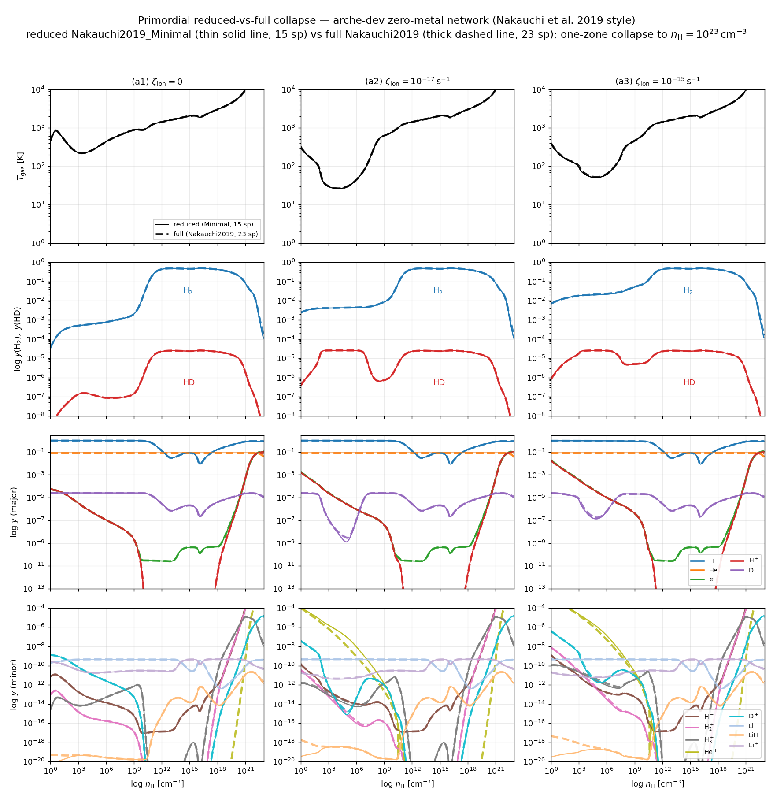

# Example: Nakauchi et al. 2019 — primordial reduced-vs-full comparison

Primordial (zero-metal) one-zone collapse, comparing the **reduced
Nakauchi2019_Minimal** model (15 species) against the **full Nakauchi2019**
model (23 species), in the spirit of

> Nakauchi, Omukai & Susa (2019) MNRAS, 488, 1846
> [[ADS](https://ui.adsabs.harvard.edu/abs/2019MNRAS.488.1846N/abstract)]

It uses the same figure format as the [`nakauchi2021`](../nakauchi2021/) metal
example, with one change: primordial chemistry has **no metallicity axis**, so
the two lower rows — which hold `log y(e⁻)` and `log y(gr⁻)` in the metal Fig.10
— are replaced by a **major / minor species breakdown** of the Minimal network.
Every species the Minimal model carries is plotted, so the figure doubles as a
species-by-species reduced-vs-full validation.

## Grid

`run_prim.sh` runs 3 cosmic-ray ionization rates × {reduced, full} = 6
collapses, each to nₕ = 10²³ cm⁻³:

| Parameter | Values |
|---|---|
| ζ_ion | 0, 10⁻¹⁷, 10⁻¹⁵ s⁻¹ |
| network | reduced (`arche_collapse_prim_minimal`) / full (`prim_collapse`) |

## Usage

Run from the **project root**:

```bash
# Step 1: build both binaries + run the 6-case grid
bash examples/nakauchi2019/run_prim.sh
#   (re-run with --no-build to reuse already-built binaries)

# Step 2: plot
python3 examples/nakauchi2019/plot_prim.py
```

Output:
- data: `results/nakauchi2019/collapse_CR<ζ>[_min].h5`
- figure: `results/nakauchi2019/fig_prim_reduced_vs_full.png`

## Panels

| Row | Content |
|---|---|
| (a) | T_gas |
| (b) | y(H₂), y(HD) |
| (c) | **Major species**: H, He, e⁻, H⁺, D |
| (d) | **Minor species**: H⁻, H₂⁺, H₃⁺, He⁺, D⁺, Li, LiH, Li⁺ |

Columns are the three ζ_ion values. In rows (c)/(d) colour = species (legend in
the rightmost column). To make the near-perfect reduced/full agreement readable
at a glance, the **full** model (23 sp) is drawn as a **thick dashed line**
and the **reduced** Minimal model (15 sp) as a **thin solid line** on top: where
they agree the solid line tracks the dashes; where they diverge the solid line
visibly leaves them.

The major/minor split is by typical abundance and is set near the top of
`plot_prim.py` (`MAJOR` / `MINOR` lists) — adjust there if you prefer a different
grouping.

## Notes

- Reduced and full overlap across nearly all species and densities, confirming
  the 15-species Minimal network reproduces the full 23-species chemistry and
  thermal evolution.
- **He⁺ at ζ_ion = 0**: the Minimal network produces He⁺ only via cosmic-ray
  ionization (it omits collisional He ionization and the H/He charge-transfer
  reactions), so without cosmic rays its He⁺ stays ~0 while the full network
  forms a trace amount collisionally at high T. This is the one expected
  reduced-vs-full difference in the minor panel.

## Output


