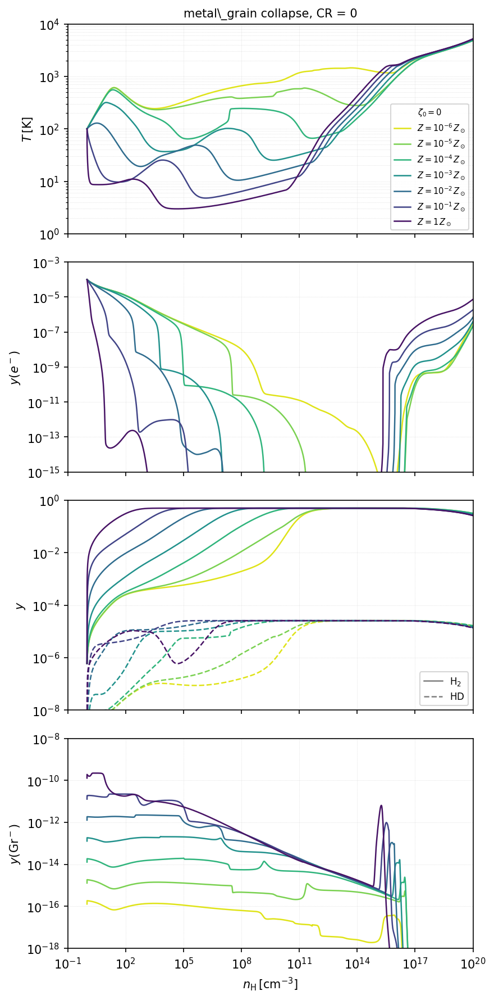

# Example: Nakauchi et al. 2021

Reproduction scripts for comparing with figures (Figures 10a1, b1, c1, and d1) in:

> Nakauchi et al. (2021) MNRAS, 502, 3394
> [[ADS](https://ui.adsabs.harvard.edu/abs/2021MNRAS.502.3394N/abstract)]

## Cases

`run_cr0_zscan.sh` runs `metal_grain` collapse for CR = 0 across 7 metallicities:

| Parameter | Values |
|---|---|
| ζ₀ | 0 |
| Z/Z☉ | 1e-6, 1e-5, 1e-4, 1e-3, 1e-2, 1e-1, 1e+0 |

## Usage

Run from the **project root**:

```bash
# Step 1: simulate (build + run all 7 cases)
bash examples/nakauchi2021/run_cr0_zscan.sh

# Step 2: plot
python3 examples/nakauchi2021/plot_cr0_zscan.py --save results/cr0_zscan
```

Output: `results/cr0_zscan/fig_cr0_zscan.png`

## Panels

| Panel | Content |
|---|---|
| T | Gas temperature vs nH |
| y(e⁻) | Electron abundance vs nH |
| y(H₂), y(HD) | Molecular abundances vs nH |
| y(Gr⁻) | Negatively charged grain abundance vs nH |

## Output


