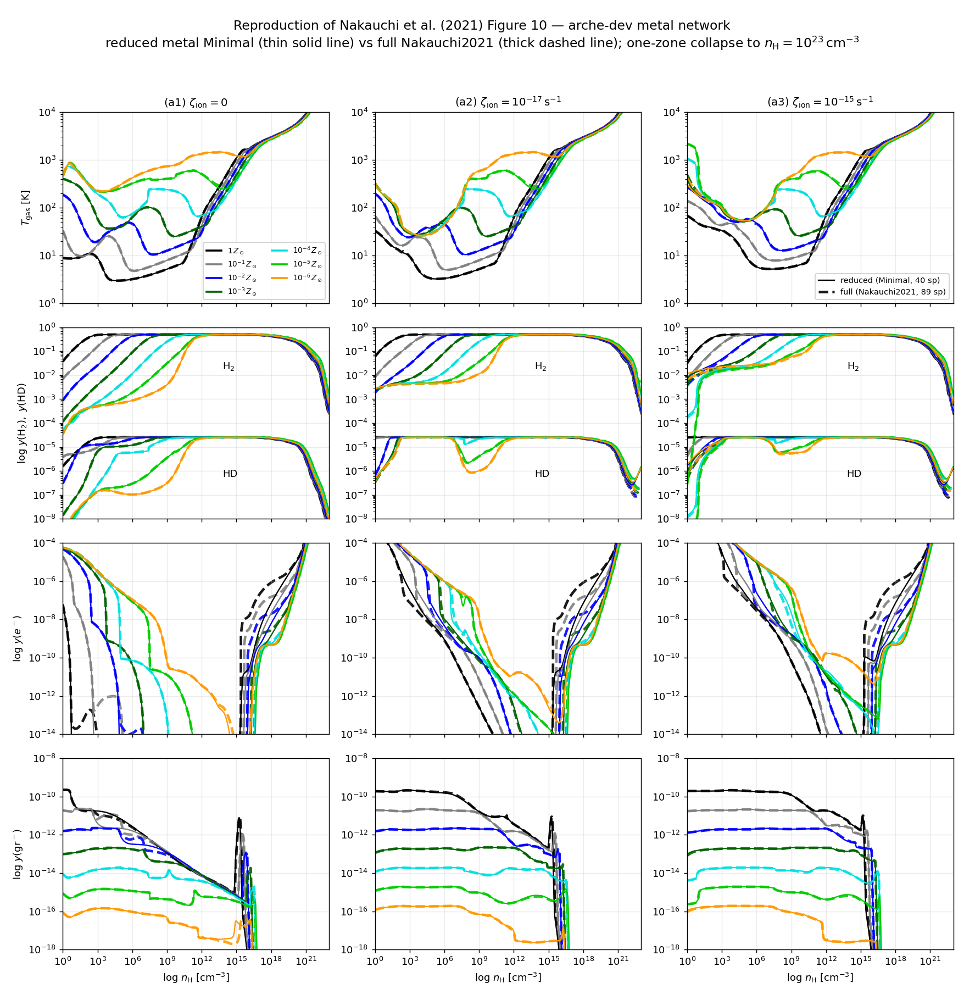

# Example: Nakauchi et al. 2021

Reproduces **Figure 10** of

> Nakauchi, Omukai & Susa (2021) MNRAS, 502, 3394
> [[ADS](https://ui.adsabs.harvard.edu/abs/2021MNRAS.502.3394N/abstract)]

with the arche `metal_grain` network, comparing the **reduced metal
Minimal** model (40 species) against the **full Nakauchi2021** model (89
species) over a one-zone gravitational collapse to nₕ = 10²³ cm⁻³.

## Grid — Figure 10

`run_fig10.sh` runs 7 metallicities × 3 cosmic-ray ionization rates × {reduced,
full} = 42 collapses:

| Parameter | Values |
|---|---|
| Z/Z☉ | 1, 10⁻¹, 10⁻², 10⁻³, 10⁻⁴, 10⁻⁵, 10⁻⁶ |
| ζ_ion | 0, 10⁻¹⁷, 10⁻¹⁵ s⁻¹ |
| network | reduced (`arche_collapse_metal_minimal`) / full (`metal_collapse`) |

## Usage — Figure 10

Run from the **project root**:

```bash
# Step 1: build both binaries + run the 42-case grid
bash examples/nakauchi2021/run_fig10.sh
#   (re-run with --no-build to reuse already-built binaries)

# Step 2: plot
python3 examples/nakauchi2021/plot_fig10.py
```

Output:
- data: `results/nakauchi2021/collapse_CR<ζ>_Z<z>[_min].h5`
- figure: `results/nakauchi2021/fig10_reproduction.png`

## Panels (paper layout)

| Row | Content | y-range | nₕ range |
|---|---|---|---|
| (a) | T_gas | 10⁰–10⁴ K | –10²³ |
| (b) | y(H₂), y(HD) | 10⁻⁸–10⁰ | –10²³ |
| (c) | y(e⁻) | 10⁻¹⁴–10⁻⁴ | –10²³ |
| (d) | y(gr⁻) | 10⁻¹⁸–10⁻⁸ | –10²³ |

Columns are the three ζ_ion values; colour = metallicity (black = 1 Z☉ → orange
= 10⁻⁶ Z☉, matching the paper's legend). To make the near-perfect reduced/full
agreement readable at a glance, the **full** model is drawn as a **thick dashed
line** and the **reduced** model as a **thin solid line** on top:
where they agree the solid line tracks the dashes; where they diverge
(e.g. e⁻ at nₕ ≳ 10¹⁵) the solid line visibly leaves the dashes.

## Agreement with the paper

- **(a) T**: lower Z → hotter (weaker dust cooling). Reduced/full overlap at all
  Z and ζ.
- **(b) H₂/HD**: reduced and full agree across the grid.
- **(c) e⁻**: reduced ≈ full over most of the density range. For nₕ ≳ 10¹⁵ the
  reduced model falls below the full one — the missing K/Na collisional
  ionization channels (the paper's key point).
- **(d) gr⁻**: grain negative charge grows with metallicity; reduced/full agree.

## Output



---

## Companion grid — CR = 0 metallicity scan

`run_cr0_zscan.sh` runs the **full** `metal_grain` network at ζ_ion = 0 over the
same 7 metallicities, without the reduced/full comparison. It isolates the
metallicity dependence when no cosmic-ray ionization is present.

| Parameter | Values |
|---|---|
| Z/Z☉ | 1, 10⁻¹, 10⁻², 10⁻³, 10⁻⁴, 10⁻⁵, 10⁻⁶ |
| ζ_ion | 0 s⁻¹ |
| network | full (`metal_collapse`) |

Run from the **project root**:

```bash
# Step 1: build the binary + run the 7-case grid
bash examples/nakauchi2021/run_cr0_zscan.sh
#   (re-run with --no-build to reuse an already-built binary)

# Step 2: plot
python3 examples/nakauchi2021/plot_cr0_zscan.py
```

Output:
- data: `results/cr0_zscan/metal_grain/collapse_CR0_Z<z>.h5`
- figure: `results/cr0_zscan/fig_cr0_zscan.png`

Panels: T, y(e⁻), y(H₂) + y(HD) (H₂ solid, HD dashed), and y(gr⁻), each against
nₕ with one curve per metallicity.
